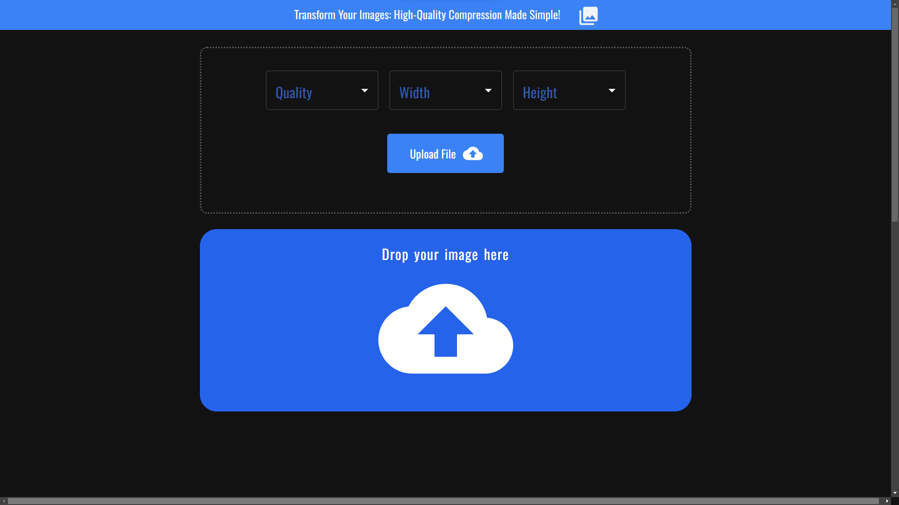

# Image compressor  

An image compression tool that allows you to reduce file sizes without compromising image quality.  



### website: https://arr-react-image-compressor.netlify.app/ ###

## Built with

- [React](https://react.dev/) - A JavaScript library that allows you to create user interfaces.
- [TypeScript](https://www.typescriptlang.org/) -  A strongly typed programming language that builds on JavaScript.
- [Tailwind-css](https://tailwindcss.com/) - A utility-first CSS framework.
- [compressorjs](https://github.com/fengyuanchen/compressorjs)  - A JavaScript image compressor library.
- [Vite](https://vitejs.dev/) - A tool that is used for building fast and optimized web applications. 

 ### Features ###  
 
 - Users can click to upload the image or just drag and drop the image in the container.
 - Select properties like width, height, and quality.
 - Validate the file to determine whether it is an image or not.


## Installation

- Clone the repository

```sh
git clone https://github.com/arr199/ImageCompressor
```

- Install dependencies

```sh
npm install
```

- Run server

```sh
 npm run dev
```
